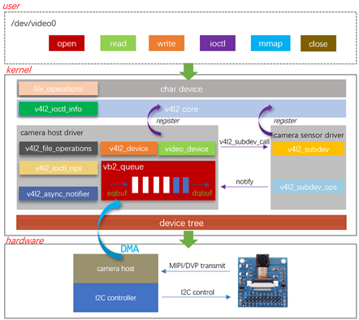

# camera-driver

#### 1. Introduction

Porting OV2640 Camera onto IMX6ULL Development Board

#### 2. V4L2 subsystem architecture diagram

#### 3. Installation Tutorial

In a Linux environment, execute "make arm_module" to compile it into a .ko module file. Power on the development board, execute 'insmod ov2640_driver.ko' to load the module, and then execute "./camera_app" to start capturing images.

#### 4. Open-source library - mjepg_streamer 

http://www.ijg.org/files

https://github.com/jacksonliam/mjpg-streamer

